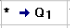

# Эмулятор машины Тьюринга
> Самый простой пример-велосипед

### `f(x,y,z) = x+y*z`
- `g(x,y) = f(x,y,y)`
- `n(x,y) = f (x,y,2)`
-----
- `g(4,3) => f(4,3,3)` => 1111+111*111
- `n(4,3) => f(4,3,2)` => 1111+111*11

### Начальные установки


## Запуск в Algo2000

Получаем ответ: 1111111111111 => 13 (в десятичной)

# Запуск Скрипта
```bash
$ npm run start
# or
$ yarn start
# or
$ node index.js
# or
$ nodejs index.js
or (only for first commit)
$ ctr+c from index.js => open console in chrome => ctrl+v
```


# Файлы на вход
 - alphabet - содержит алфавит. Порядок должен быть такой же как у строк в таблице переходов
 - lenta - кусок бесконечной ленты
 - table.json - таблица переходов
 
 ### О том как устроенна таблица переходов
 
 Пример ячейки в таблице: `*>1`, где
  - `*` символ на который надо заменить, 
  - `>` смещение каретки вправо (`<` - влево, `!` - стоп)
  - `1` состояние в которое нужно перейти
 
 > e - сокращенно от error, Что означает Ошибка. В данную ячейку нельзя попасть.
