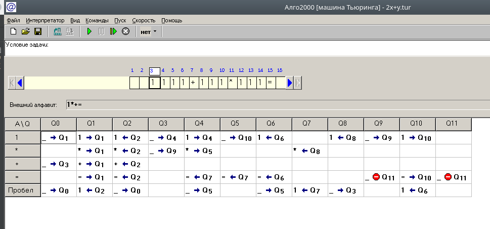
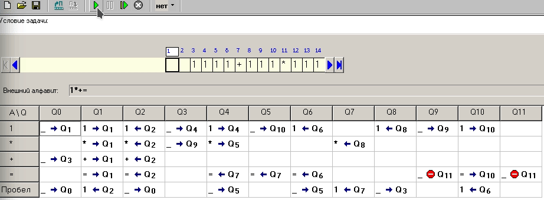

# Эмулятор машины Тьюринга
> Самый простой пример-велосипед

### `f(x,y,z) = y+x*z`
- `g (x,y) = f(x,y,x)`

`g(3,4) => f(4,3,3)` => Переводим в унарную систему => 1111+111*111

### Начальные установки

## Запуск

Получаем ответ: 1111111111111 => 13 (в десятичной)
